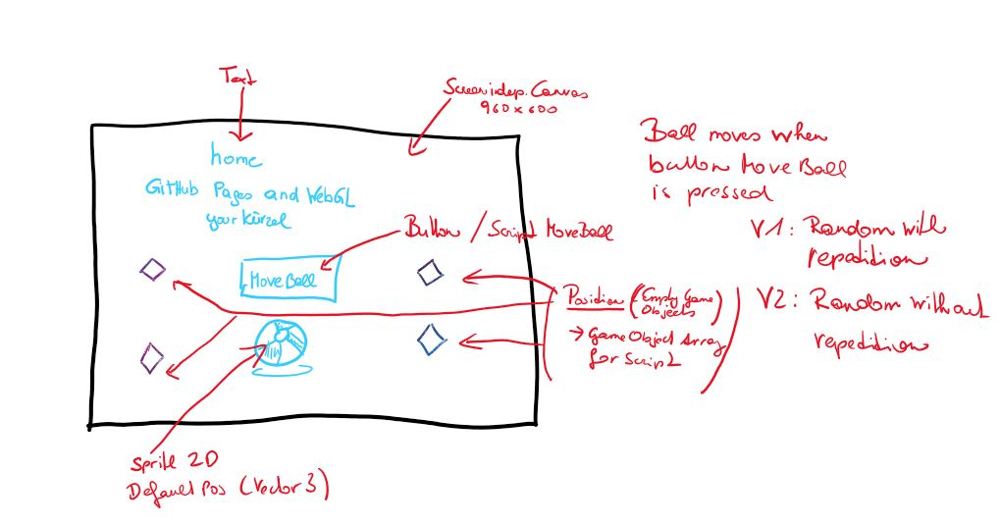

# home-WebGL-movingball-ahagenstein

### Project description: 
This simple project consists of a screen-independent canvas (960x600), 
a button (Move Ball), a text (title with developer name), a script (moving the ball with the button), 
and a GameObjects ball (sprite2d imported)

When pressing the button "Move Ball" the ball moves randomly to a new position. 
4 Positions are available (4 empty GameObjects: PosBottomLeft, PosBottomRight, PosTopLeft, PosTopRight).
There are 2 different variations for moving the ball to the positions randomly.
* Variation 1: direct repetition of the randomly chosen position is possible.
* Variation 2: the randomly chosen position is forced to be different, i.e. new position != old position    

### Development platform: 
- macOS Catalina Version 10.15.1 
- Unity Version: 2019.1.14f1
- Visual Studio Code Version: 1.30.2
- Scripting Runtime Version: .NET 4.x Equivalent
- API Compatibility Level: .NET 2.0
         
### Target platform: 
WebGL incl. reference resolution 960x600

### Visuals: 

- Copyright by smeerws

### Necessary setup/execution steps: 

WebGL has to be installed.

### Third party material: 

### Project state: 

### Limitations: 

None

### Lessons Learned: 

* Generate and use random numbers
* Use a script in combination with a button
* Build for the WebGL platform
* Publish a WebGL project on GitHub Pages via folder docs

Copyright by Anna Hagenstein :)

